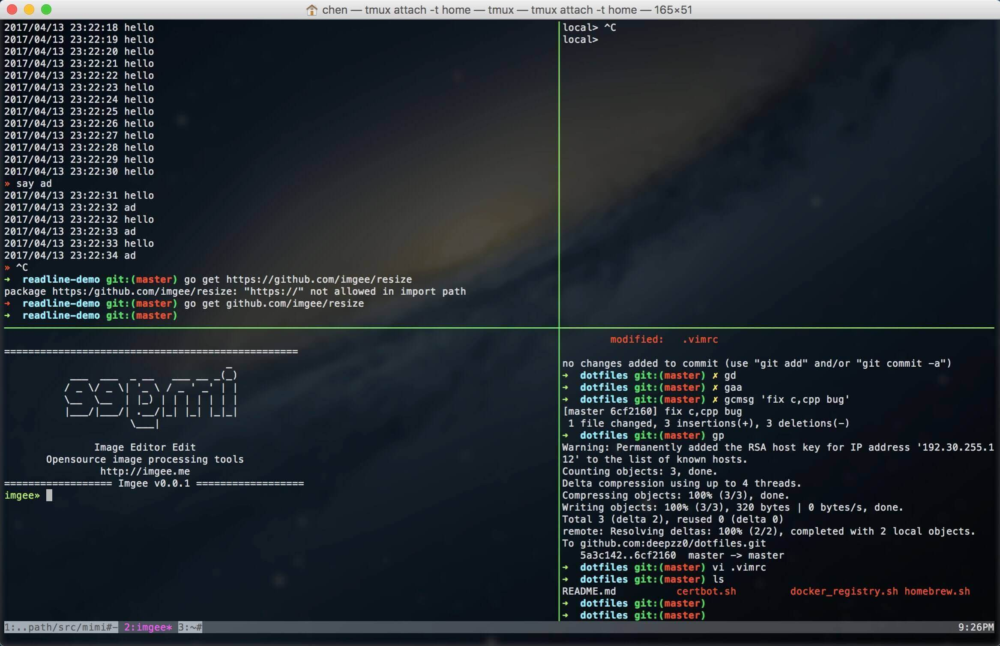

### 使用方式

你可以直接使用 `make` 命令安装或执行命令：
```
# 安装 homebrew
$ make homebrew

# 安装 zsh
$ make zsh

# 安装 vim 配置
$ make macvim

# 安装 neovim 配置
$ make neovim

# 安装 tmux 配置
$ make tmux
```

### Macvim


**使用流程**

1、确保你已安装 tmux，且版本在 2.1 以上。

2、确保你已经安装：`reattach-to-user-namespace`。

3、复制或软链本仓库文件`.tmux.conf` 到 `~/.tmux.conf`。

4、享受你的 tmux 之旅。


**效果与技巧**

1、前缀修改 `Ctrl+b` 为 `Ctrl+a`。

2、重新加载 `.tmux.conf` 文件：`前缀+R`。

3、滑动鼠标进入 vi 模式。

4、显示 pane 编号：`前缀+q`。

5、选中 pane：`前缀+j/k/h/l`。

6、改变 pane 大小：`前缀+J/K/H/L`。

7、创建新窗口：`前缀+c`。

8、关闭窗口：`前缀+&`。

9、选择窗口：`前缀+窗口数字`。

10、新建 pane：`前缀+v/s`。

11、关闭 pane：`前缀+x`。

12、进入复制模式：`前缀+[`，按 `y` 复制到系统剪贴板，`Enter` 复制到 tmux 剪贴板。

13、粘贴剪贴板内容：`前缀+]`。


### Tmux


**使用流程**

1、复制或软链本仓库文件 `.vimrc` 到 `~/.vimrc`。

2、安装 vim 插件管理器：`$ git clone https://github.com/VundleVim/Vundle.vim.git ~/.vim/bundle/Vundle.vim`。

3、进入 macvim，输入  `:PluginInstall` 安装插件。

4、编译代码补全插件 `YouCompleteMe`：[https://github.com/Valloric/YouCompleteMe#mac-os-x](https://github.com/Valloric/YouCompleteMe#mac-os-x)。

5、享受你的 vim 编程之旅。


**效果与技巧**

1、打开与关闭目录 *NERDTree*：`⌘+e`。

2、相对或绝对行号显示：`Ctrl+n`。

3、左右切换 Buffer：`H/L`=>`Shift+H/L`。

4、折叠代码段：`,+zz`。

5、简单符号环绕：`VISUAL` 模式，选中字符，输入符号。支持："，'，`，[]，()，{}。

6、切换窗口：`Ctrl+j/k/h/l`。

7、切换 Tab：`,+0-9`。

8、超级权限保存文件：`:w!!`，该命令需要快速键入，否则无效。

9、取消搜索高亮：`,+/`。

10、选择所有文本：`,+s+a`。

11、快速保存：`,+w`。

12、删除 Buffer：`,+b+d`。

13、搜索文件：`⌘+p`。

14、全局搜索关键词 CtrlSF：`⌘+f`。

15、在此打开 CtrlSF 结果：`:CO`。

16、批量注释代码：`⌘+/`。

17、显示 Tagbar：`⌘+y`。

18、选中代码片段 Ultisnips：`TAB`。

19、批量选中，批量修改：`Enter`。

更多详细请查看 `.vimrc` 内容。
